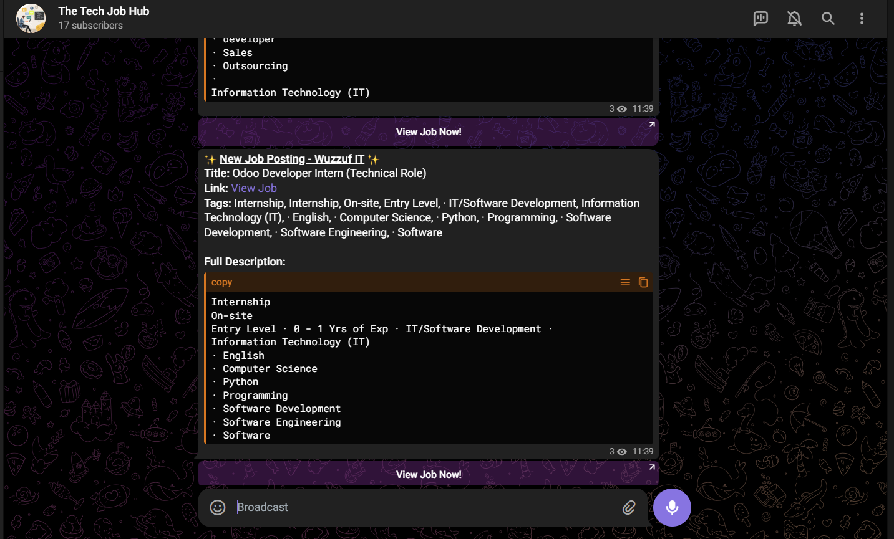

<p align="center">
  
  
  <a href="https://github.com/ahmedothman21/DevOps-jobs/actions">
    
  </a>
  
</p>

# Job Scraper

A robust job scraping solution that monitors job postings and sends notifications via Telegram.

---

## 🚀 Quick Start

### Windows
1. **Double-click** `Run.bat` or run it from the command line:
   ```bat
   Run.bat
   ```
   _Automatically installs dependencies and launches the scraper._

### Manual Setup (All Platforms)
1. **Clone the repository:**
   ```bash
   git clone https://github.com/AhmedOthman21/DevOps-jobs
   cd job-scraper
   ```
2. **Create and activate a virtual environment:**
   ```bash
   python -m venv venv
   # On Windows:
   venv\Scripts\activate
   # On Linux/macOS:
   source venv/bin/activate
   ```
3. **Install dependencies:**
   ```bash
   pip install -r requirements.txt
   ```
4. **Configure the app:**
   - Edit `config.py` as needed
   - Add your Telegram bot token if using notifications
5. **Run the scraper:**
   ```bash
   python main.py
   ```

---

## 🧩 Features
- Automated job scraping from multiple sources
- Real-time Telegram notifications
- Customizable search criteria
- Duplicate detection
- Detailed job information extraction
- Docker support for easy deployment

---

## 📁 Project Structure
```
src/
├── scrapers/        # Job scraping implementation
├── utils/           # Utility functions and helpers
└── data_extractors/ # Data extraction and processing

docker/              # Docker-related files
├── Dockerfile
└── Dockerfile.multi-stage

assets/              # Project assets (images, etc.)
└── telegram-notification.png.png
```

---

## 🐳 Docker Support
- **Docker Hub:** [3ito/devops-job-scraper](https://hub.docker.com/repository/docker/3ito/devops-job-scraper/)
- **Pull and run:**
  ```bash
  docker pull 3ito/devops-job-scraper:latest
  docker run -d 3ito/devops-job-scraper
  ```

---

## 🛠️ Development
- **Install dev dependencies:**
  ```bash
  pip install -r requirements-dev.txt
  ```
- **Set up pre-commit hooks:**
  ```bash
  pre-commit install
  ```
- **Code style:**
  - isort for import sorting
  - Google Python Style Guide for docstrings
  - Max line length: 88 characters
- **Run tests:**
  ```bash
  pytest .
  ```

---

## 🤝 Contributing
1. Fork the repository
2. Create your feature branch (`git checkout -b feature/amazing-feature`)
3. Commit your changes (`git commit -m 'Add amazing feature'`)
4. Push to the branch (`git push origin feature/amazing-feature`)
5. Open a Pull Request

---

## 📜 License
This project is licensed under the MIT License. See the LICENSE file for details.

---

## 🙏 Acknowledgments
- ChromeDriver - WebDriver for Chrome
- Selenium - Web browser automation
- python-telegram-bot - Telegram Bot API wrapper